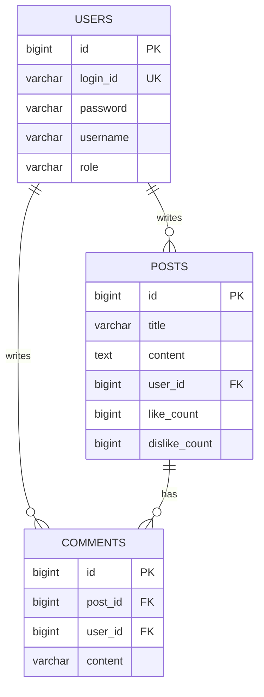

# Mini Board (Spring Boot Community Project)

Java와 Spring Boot를 기반으로 구현한 **커뮤니티 게시판 웹 애플리케이션**입니다.
JPA와 Spring Security를 사용하지 않고, **JDBC 기반 데이터 접근과 세션 기반 인증/인가를 직접 구현**하여 웹 애플리케이션의 핵심 동작 원리를 명확히 이해하는 것을 목표로 개발했습니다.

---

## Project Overview

본 프로젝트는 Spring Boot 3.x 환경에서 **게시글, 댓글, 회원 관리 기능을 제공하는 커뮤니티 서비스**입니다.
프레임워크가 제공하는 고수준 추상화(JPA, Spring Security)에 의존하지 않고, 다음과 같은 영역을 직접 설계·구현했습니다.

* JDBC 기반 SQL 처리
* HttpSession 기반 인증
* 인터셉터를 활용한 역할 기반 접근 제어(RBAC)
* 서버단 권한 검증 로직

이를 통해 **요청 흐름, 인증 처리, 데이터 접근 구조**를 보다 명확히 이해하고자 했습니다.

---

## Service Access

* URL: [http://3.35.209.240:8080](http://3.35.209.240:8080)
* ADMIN

  * ID: `admin1`
  * PW: `admin1`

---

## Tech Stack

### Backend

* Java 17
* Spring Boot 3.x
* Spring MVC
* Spring JDBC (`NamedParameterJdbcTemplate`)
* MySQL 8.0

### Frontend

* Thymeleaf
* Bootstrap 5

---

## Key Features

### 게시글 관리 (Board)

* 게시글 작성, 조회, 수정, 삭제 (CRUD)
* 검색 조건(제목, 내용, 작성자)을 조합한 **동적 검색 기능**
* `LIMIT / OFFSET` 기반 페이징 처리로 대량 데이터 대응

### 회원 인증 및 권한 관리 (Auth & RBAC)

* Spring Security 미사용

* `HttpSession` 기반 로그인 처리

* `Interceptor`를 활용한 인증 및 권한 검증

* 역할(Role)에 따른 접근 제어

  * `ADMIN`: 게시글·댓글 관리, 회원 관리
  * `USER`: 게시글 및 댓글 작성, 본인 글 수정/삭제
  * `GUEST`: 조회 전용 접근

* 비밀번호는 `BCryptPasswordEncoder`를 사용해 단방향 암호화

### 댓글 기능

* 게시글별 댓글 작성 및 삭제
* 서버단에서 작성자 검증을 수행하여 비인가 요청 차단

---

## Technical Decisions

### JDBC 기반 데이터 접근

ORM 대신 JDBC를 선택하여 SQL 실행 흐름과 데이터 조회 비용을 명확히 제어했습니다.

* `NamedParameterJdbcTemplate`을 사용해 SQL 가독성과 파라미터 바인딩 안정성 확보
* 연관 데이터 조회 시 `JOIN` 쿼리를 직접 작성하여 N+1 문제 방지

### 인증·인가 구조

Spring Security의 필터 체인 대신, MVC 인터셉터를 사용해 요청 흐름을 단순화했습니다.

* `LoginCheckInterceptor`: 인증 여부 검증
* `RoleCheckInterceptor`: URL 패턴 기준 권한 검증 (`/admin/**` 등)
* 권한 부족 시 `403 Forbidden` 응답 처리

### 계층 분리 및 DTO 설계

* Controller / Service / Repository 역할 분리
* Request DTO와 Response DTO를 분리하여 View와 내부 로직 간 의존성 최소화

---

## ERD

